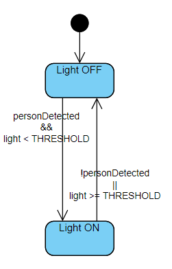

# Centralized

In this case the assignement was pretty short and easy, so the resultant finite state machine is her self short.
For this case it was just necessary to implement a simple agent based on a superloop paradigm, like it can be seen in the code, the agent is a simple Thread which runs infinetly doing two separate steps:
- Sense the world thorugh sensors.
- Turn on/off light based on data sensed.