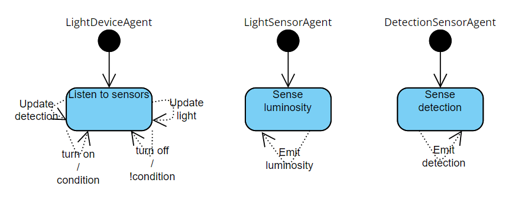

# Distributed

This scheme seems harder to understand than the previous one, but it can be easily summed up thinking about the architecture of the project:
In this case we have 3 different components, 2 of them (sensors) sense the world to retrieve data and publish it in their topics through the MQTT framework; the lonely device listen to messages in topics and act in response of it, turning on and off the light.