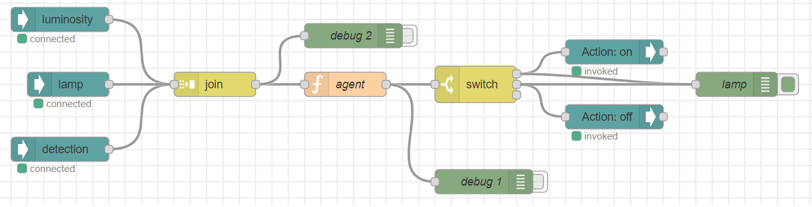

# Report activity-2

## Argument
Same problem of activity-1, a smart lamp connected to 2 sensors which turn on and off automatically based on data collected, in this case it was important to solve the situation taking a WoT (Web of Things) approach, the whole activity can be summerized in two parts:

#### Things services
WoT defines communications over a basic protocol which is composed by 4 actions:
- Read a property
- Write a property
- Take action
- Register to events
  
Behind those there is a strong choice of standardization, to fully comply at WoT idea it's needed to implement a route on our "thing" which return the API of our device following an accurate schema. In this way it's possible (not in this case of study, but interesting) to explore ideas on "auto discovering devices", making the decive understand how to use other "thing" autonomously.

In this activity i decided to implement services published thorugh an HTTP adapter:
- lamp running on port 8888
- luminosity sensor on port 8889
- presence detection on port 8890

all of those implementes the API route discussed before and some data read and actions in case of the lamp (turn on and off).

#### Things consumer
In this activity there is a strong focus on separating the logic of functioning from the communications stuff, in this way is possible to focus on the functioning without being disturbed from protocols and slowing stuff. Consumers were to be implement in 2 different ways:

###### As in activity-1
As we had HTTP adapter in services, here in consumer we have HTTP proxy, which job is once again to hide from the logic of functioning, the communications related stuff.
For this first version i choosed to make the consumer react to events posted from the services using the fourth possible action on WoT described above.
Every time a new event is published, the consumer update his state and check if is needed to turn on or off the lamp, just like we did in activty-1.

###### With node-red
This version was pretty fun, a bit of "block programming" to discover how WoT can simplify developing logic of functioning:

Starting from the left we have 3 blocks which make polling once every second and join their result in the "join" block after them, then the agent decide what to do based on data received, the switch block is needed to make agent decision be taken, if "on" Action: on is called on lamp device, else if "off" Action: off is called, if "nothing" so nothing happen; green blocks are for debug, the last on the right prints out only when light get switched on or off.