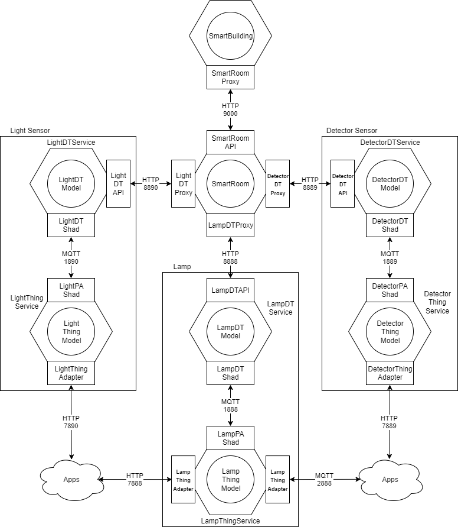

# Activity-03
## Smart building with dt
### Idea
In this activity we want to upgrade the latest things done, adding another layer of abstraction like the "digital twin" and on top of that designing a smart building able to control every single smart room through an high level API.

### Design
Here there's a lot to discuss, here i'll be short using an image as support:

At an high level we denote 6 different components:
- Lamp
- Detector sensor
- Light sensor
- Smart room
- Smart building
- Apps

Every component is separated from the other by an abstraction of communication like HTTP or MQTT.

### Lamp, detector and light sensor
Those three components share the same design and structure, any of them is represented by a physical thing (simulated by a digital model) and his digital twin.

The physical thing is the same as the latest activity, in this case we have another adapter called shadow pointing to his digital twin implemented through MQTT, that's usefull in order to realize the paradigma of digital twin, which is always updated as soon as he receives data from the thing and offer an high level API to interact with sensor.

### Smart room
That is the actual consumer, the place where the logic of autonomous controlling is implemented and computed, in this case is not specified where this computation should be done and could be done in various way (like we explored in other activities).

This component also offer an other high level API for checking and controlling sensors inside the room it represents; in a sense we could see this component as the digital twin of the room, but we don't actually have the room as a thing, but in this case we can see the thing-dt sensor component as the room thing we're digital twining, i'm not sure that's really makes sense or if in generale there's a sense of adding layers of digital twin but after coded that i think it sounds good.

### Smart building
Smart building is the owner of smart rooms, in this case i designed it to communicate with smart rooms by any of the adapter (e.g. HTTP), thanks to the API early discussed we can manipulate or check status of rooms through a single point, obviously this component neeeds to knows the structure of the building (what rooms are present), this can be done in various way.

The smart room API is an aggregation of the sensor behind it, like this we can actually ask for the status of the room and receiving all the sensor data through a single query.

### Apps
The latest components discussed are based on digital twins and take advantages from those to simplify communication and subscribe methods, this component instead represent the physical nearer object to sensors, as a separated thing from digital twin.

As in paradigma of digital twin they are hosted somewhere, and this somewhere could be on cloud, the importance of this component rely on the fact that we need to have a way to work even if the cloud, or internet, is lost, it would be funny hearing a phrase like: "i can't turn off the light because internet is gone".

In this case i didn't code anything to simulate this component, but provided adapters to integrate if needed, that just because it wasn't needed for the project and not really interesting.