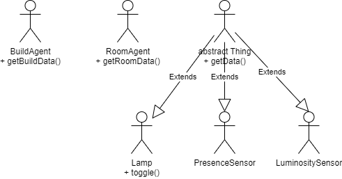

# Activity-04
## Smart building with dt
### Idea
This last activity aim to exploit all the possibilities offered by JaCaMo, a framework for multi agent programming which is the combination of three separate technologies: Jason, Cartago and Moise; by implementing a smart building with multiple smart rooms.
We talked about Jason in the last activity, let's sum up with the other two.

### Cartago
CArtAgO is a general purpose framework that makes it possible to program and execute virtual environments for multi agents systems.
CArtAgO is based on the Agents & Artifacts (A&A) meta-model which introduces high-level metaphors taken from human cooperative working environments: agents as computational entities performing some kind of task/goal-oriented activity, and artifacts as resources and tools dynamically constructed, used, manipulated by agents to realise their individual and collective activities.
- Workspaces: A CArtAgO environment is given by one or multiple workspaces, in order to work inside a
workspace an agent must join it. By default, when booted, an agent is automatically joined to the
default workspace. Then, the same agent can join and work simultaneously in multiple workspaces.
- Agents’ action repertoire: By working inside a CArtAgO environment, the repertoire of an agent’s actions is determined by the set of artifacts available/usable in the workspace, in particular by the operations provided by such artifacts.

### Moise
Moise is an organisational model for Multi-Agent Systems based on notions like roles, groups, and missions. It enables an MAS to have an explicit specification of its organisation. This specification is to be used both by the agents to reason about their organisation and by an organisation platform that enforces that the agents follow the specification.

### Design
In order to follow an understandable and brief design, i'll talk about the three technologies separately, noticing how they actually work good together:
- Jason: the core functioning of smart room will be the same, an agent for every sensor, communicating to accomplish the expected behaviour. I'd add a building agent to aggregate smart rooms states, communicating with new room agents, which just mirror the state of each room (a sort of digital twin).
- Cartago: each room share the same group of artifacts, in this case used to communicate between agents, but they're not strictly the same, to have a logic separation we use workspaces, in particular one workspace for each room. Considering the new agents added (build agent and room agents), we'll need new artficats to realize communication with and within those.
- Moise: at this level we want to organize agents work at an higher level of abstraction, in Moise+ as in moise, three main concepts, roles, role relations and groups, are be used to build, respectively, the individual, social and collective structural levels of an organization, like so follows the specification for each level:
  - Individual level: specify the roles of the organization, a role is a set of constraints an agent ought to follow when accepts to enter a group playing that role. For roles we have rules similar to OOP inheritance, a sub-role has the same constraints as his father and can exists abstract roles that must be explicity inherited in order to be used. For a better understanding of roles in our case, i'll be using a scheme: 
  - Social level: while the individual level tells us how a role is going to work and specify the inheritance between them, this level specify other links more than inheritance, formally: link(Ps, Pd, t) specify a link between the role Ps (source) and Pd (destination) of type t, which can be one of those three:
  
    - Acquaintance (acq): the agents playing role Ps are allowed to have a representation of the agents playing the Pd role.
    - Communication (com): Ps agents are allowed to communicate with Pd agents.
    - Authority (aut): Ps agents are allowed to have authority on Pd agents, i.e. control them. 
  
    In this case we'll have following links:
      - link(Thing, RoomAgent, com)
      - link(RoomAgent, BuildAgent, com)
      - link(RoomAgent, Thing, aut)
      - link(BuildAgent, RoomAgent, aut)

    To notice that those links are inherited through individual level connections. Also major links implicit cause minor links (i.e. aut implicit cause com, com implicit cause acq).

  - Collective level: this level describe constraints to be followed when an agent change his role, in particular describe which role an agent can change to, based on the role it currently has, formally: the compatibility constraint Pa ▷◁ Pb states that agents playing the role Pa are also allowed to play the role Pb (NOT vice versa). In this case i didn't find any usefull use for this level.

